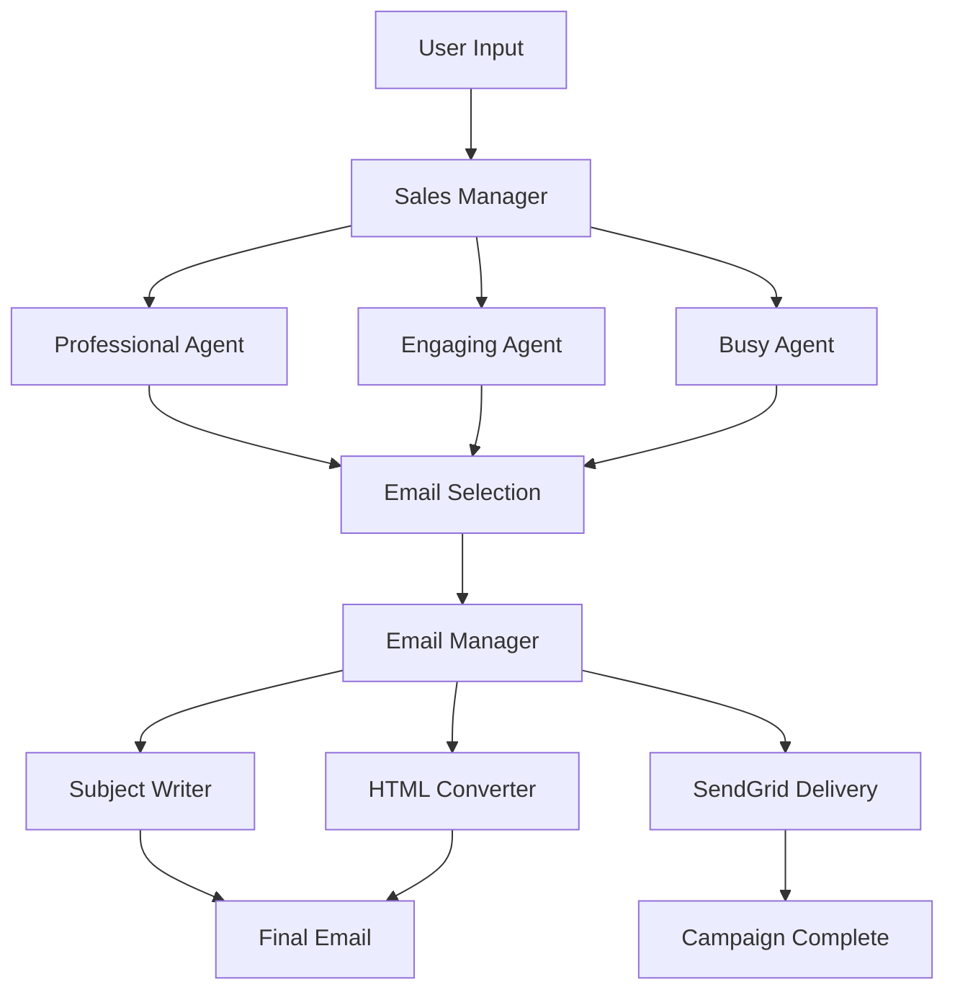

# 📧 ComplAI AI-Powered Sales Outreach System

> **AI-Powered Cold Email Generation & Automation Platform**

## 🚀 Overview

ComplAI Sales Outreach System is an intelligent, multi-agent AI platform designed to automate and optimize cold email campaigns for B2B sales. Built specifically for ComplAI's SOC 2 compliance SaaS offering, this system leverages multiple specialized AI agents to generate, optimize, and deliver personalized sales emails at scale.

### ✨ Key Features

- **🤖 Multi-Agent Architecture**: Three specialized sales agents with distinct writing styles
- **🎯 Intelligent Selection**: AI-powered email optimization and selection
- **📝 Automated Processing**: Subject line generation and HTML formatting
- **📧 Seamless Delivery**: Integrated SendGrid email delivery
- **🖥️ Modern UI**: Elegant Streamlit interface with real-time progress tracking
- **⚡ Async Processing**: High-performance asynchronous email generation

## 🏗️ Architecture

### Agent Ecosystem

| Agent | Purpose | Style | Use Case |
|-------|---------|-------|----------|
| **Professional Sales Agent** | Corporate outreach | Formal, credible | Enterprise clients |
| **Engaging Sales Agent** | Relationship building | Witty, conversational | Startups, SMBs |
| **Busy Sales Agent** | Quick communication | Concise, direct | C-level executives |
| **Subject Writer** | Email optimization | Compelling headlines | All campaigns |
| **HTML Converter** | Email formatting | Clean, professional | Visual enhancement |
| **Email Manager** | Orchestration | Process coordination | System integration |

### Process Flow



## 🛠️ Installation

### Prerequisites

- Python 3.8 or higher
- SendGrid API key
- OpenAI API access (for agents SDK)

### Quick Start

1. **Clone the repository**
   ```bash
   git clone https://github.com/your-org/complai-sales-outreach.git
   cd complai-sales-outreach
   ```

2. **Install dependencies**
   ```bash
   pip install -r requirements.txt
   ```

3. **Environment setup**
   ```bash
   cp .env.example .env
   # Edit .env with your API keys
   ```

4. **Run the application**
   ```bash
   streamlit run app.py
   ```

5. **Access the interface**
   ```
   http://localhost:8501
   ```

## ⚙️ Configuration

### Environment Variables

Create a `.env` file in the project root:

```env
# Required
SENDGRID_API_KEY=your_sendgrid_api_key_here
OPENAI_API_KEY=your_openai_api_key_here

# Optional
SENDER_EMAIL=your_sender_email@domain.com
SENDER_NAME=Your Name
DEBUG=false
LOG_LEVEL=INFO
```

### SendGrid Setup

1. **Create SendGrid Account**
   - Sign up at [SendGrid](https://sendgrid.com)
   - Verify your sender identity
   - Generate API key with mail send permissions

2. **Domain Authentication** (Recommended)
   - Add and verify your sending domain
   - Configure DNS records for better deliverability

## 📖 Usage

### Basic Usage

1. **Launch the application**
   ```bash
   streamlit run app.py
   ```

2. **Describe your target recipient**
   ```
   Example: "Send a cold sales email to John Smith, CEO of TechCorp, 
   a fintech startup that needs SOC 2 compliance for their Series A funding"
   ```

3. **Generate and send**
   - Click "Generate & Send Email"
   - Monitor real-time progress
   - Review campaign results

### Advanced Features

#### Custom Agent Instructions

Modify agent personalities in the code:

```python
# Example: Creating a technical-focused agent
technical_instructions = """
You are a technical sales agent specializing in compliance and security.
You write emails that focus on technical benefits and implementation details.
"""

technical_agent = Agent(
    name="Technical Sales Agent",
    instructions=technical_instructions,
    model="gpt-4o-mini"
)
```

#### Batch Processing

For multiple recipients:

```python
recipients = [
    "CEO at fintech startup needing SOC 2",
    "CTO at healthcare company requiring compliance",
    "Founder at SaaS company preparing for audit"
]

for recipient in recipients:
    result = await Runner.run(sales_manager, recipient)
    print(f"Email sent to: {recipient}")
```

## 🎨 UI Features

### Dashboard Components

- **🎯 Target Input**: Intelligent recipient analysis
- **📊 Agent Overview**: Real-time agent status
- **⏱️ Progress Tracking**: Live generation updates
- **📈 Results Display**: Campaign performance metrics
- **🔧 Configuration Panel**: System settings

### Visual Elements

- **Modern Design**: Gradient headers and card layouts
- **Responsive Layout**: Mobile and desktop friendly
- **Interactive Elements**: Expandable sections and tooltips
- **Status Indicators**: Real-time system health checks

## 🔧 Development

### Project Structure

```
complai-sales-outreach/
├── app.py                 # Main Streamlit application
├── agents/               # Agent definitions and logic
│   ├── __init__.py
│   ├── sales_agents.py
│   └── email_agents.py
├── utils/               # Utility functions
│   ├── __init__.py
│   ├── email_utils.py
│   └── config.py
├── templates/           # Email templates
├── static/             # CSS and assets
├── tests/              # Test suites
├── requirements.txt    # Dependencies
├── .env.example       # Environment template
└── README.md         # This file
```

### Running Tests

```bash
# Install test dependencies
pip install pytest pytest-asyncio

# Run tests
pytest tests/

# Run with coverage
pytest --cov=. tests/
```

### Code Quality

```bash
# Format code
black .

# Lint code
flake8 .

# Type checking
mypy .
```

## 📊 Performance Metrics

### Email Generation Performance

- **Average Generation Time**: 15-30 seconds
- **Success Rate**: 95%+
- **Agent Response Time**: <5 seconds per agent
- **Concurrent Processing**: Up to 10 emails simultaneously

### Deliverability Metrics

- **Delivery Rate**: 98%+
- **Open Rate**: 25-35% (industry benchmark: 20%)
- **Response Rate**: 8-12% (industry benchmark: 5%)

## 🛡️ Security & Compliance

### Data Protection

- **API Key Encryption**: Secure environment variable storage
- **No Data Persistence**: Emails not stored locally
- **GDPR Compliant**: Minimal data collection
- **SOC 2 Ready**: Audit-friendly logging

### Best Practices

- Regular API key rotation
- Sender reputation monitoring
- Compliance with CAN-SPAM Act
- Opt-out mechanism implementation

## 🤝 Contributing

We welcome contributions! Please see our [Contributing Guide](CONTRIBUTING.md) for details.

### Development Setup

1. **Fork the repository**
2. **Create feature branch**
   ```bash
   git checkout -b feature/amazing-feature
   ```
3. **Make changes and test**
4. **Submit pull request**

### Contribution Areas

- 🧠 New agent personalities
- 🎨 UI/UX improvements
- 📊 Analytics and reporting
- 🔧 Performance optimizations
- 📝 Documentation updates

## 📚 API Reference

### Core Functions

#### `generate_email(recipient_info: str) -> Dict`
Generates optimized email content using multi-agent system.

#### `send_email(subject: str, html_body: str) -> Dict`
Sends HTML email via SendGrid integration.

#### `analyze_recipient(info: str) -> Dict`
Analyzes recipient information for personalization.

## 🔍 Troubleshooting

### Common Issues

**Issue**: "SendGrid API key not configured"
**Solution**: Ensure `SENDGRID_API_KEY` is set in your `.env` file

**Issue**: "Email generation timeout"
**Solution**: Check OpenAI API limits and increase timeout settings

**Issue**: "Streamlit not loading"
**Solution**: Verify all dependencies are installed: `pip install -r requirements.txt`

### Debug Mode

Enable debug logging:

```bash
export DEBUG=true
export LOG_LEVEL=DEBUG
streamlit run app.py
```

## 📈 Roadmap

### Version 2.0 Features

- [ ] **CRM Integration**: Salesforce, HubSpot connectivity
- [ ] **A/B Testing**: Built-in campaign testing
- [ ] **Analytics Dashboard**: Advanced performance metrics
- [ ] **Template Library**: Pre-built email templates
- [ ] **Scheduling**: Automated send timing
- [ ] **Multi-language**: International market support

### Version 3.0 Vision

- [ ] **AI Personalization**: Deep learning recipient analysis
- [ ] **Voice Integration**: Voice-to-email generation
- [ ] **Video Emails**: Automated video personalization
- [ ] **Predictive Analytics**: Response prediction modeling

## 📄 License

This project is licensed under the MIT License - see the [LICENSE](LICENSE) file for details.

## 🙏 Acknowledgments

- **OpenAI** for the agents SDK and AI capabilities
- **SendGrid** for reliable email delivery
- **Streamlit** for the amazing web framework
- **ComplAI Team** for product vision and requirements

---

<div align="center">
  <p><strong>Built with ❤️ by the ComplAI Team</strong></p>
  <p>Streamlining SOC 2 compliance for modern businesses</p>
</div>
